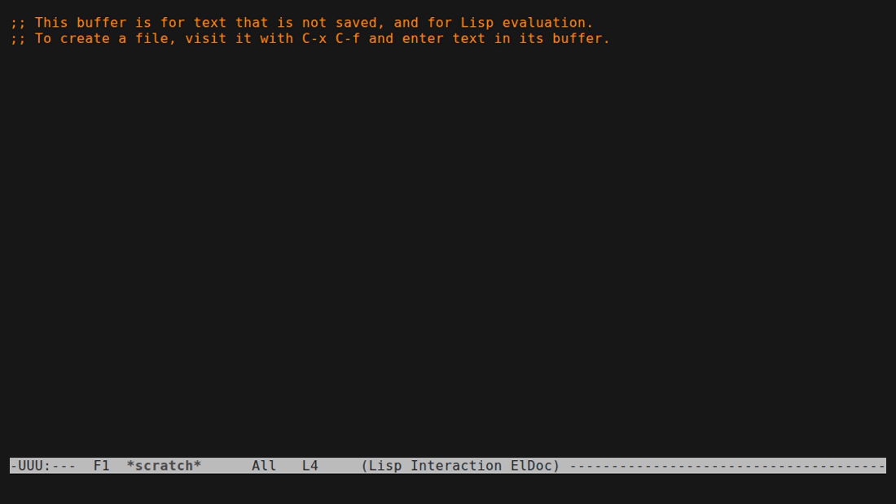

# askel.el

Ask Emacs for things in plain English; get back an executable Emacs Lisp or
shell command that you read and confirm before it runs.



```
M-x askel-now RET  split the window and open my init file RET

  openrouter/z-ai/glm-5.2 · 1.8s (Wafer)
  Splits the window and opens your Emacs init file.
  Run (elisp): (progn (split-window-right) (find-file user-init-file))
  [y] run  [e] edit  [b] buffer  [n] no:
```

## Features

- **Natural language → a real command**, shown before it runs.
- **Pluggable agents.** Default preset `openrouter` calls the OpenRouter API
  directly over HTTP for fast replies; built-in CLI presets for `pi`, `claude`,
  `codex`, and `opencode` are also available. Switch agent and model on the
  fly, or plug in your own CLI.
- **Persistent CLI agents.** The `pi` and `claude` presets keep one agent
  process alive between queries instead of spawning a fresh CLI each time, so
  a CLI subscription (e.g. a Claude account) with no OpenRouter key is fast
  too.
- **Follow-ups with history.** Ask a follow-up and the previous exchange is
  included as context.
- **Confirm-before-run.** Run, edit-then-run, inspect, or skip every command.
- **Per-query timing** (`agent/model · N.Ns`, plus the upstream provider for
  HTTP presets) so you can compare agents.

## Install

askel is a single file. Put it on your `load-path` and require it:

```elisp
(add-to-list 'load-path "/path/to/askel")
(require 'askel)

;; Optional: a global key for the main entry point.
(global-set-key (kbd "C-c a") #'askel-now)
```

With `use-package`:

```elisp
(use-package askel
  :load-path "/path/to/askel"
  :bind ("C-c a" . askel-now))
```

## Agents

The default preset, `openrouter`, calls the [OpenRouter](https://openrouter.ai)
chat-completions API directly over HTTP from Emacs (`url-retrieve`) — no CLI
subprocess. The remaining presets shell out to an agent CLI, which must be
installed and on Emacs's `exec-path`.

| Agent | `askel-agent` | Default model | Notes |
|-------|---------------|---------------|-------|
| OpenRouter (default) | `openrouter` | `z-ai/glm-5.2` | direct HTTP call, no CLI needed; see below |
| Pi | `pi` | `z-ai/glm-5.2` | tool-enabled agent; persistent process, fast after first query; `pi --list-models` lists others |
| Claude | `claude` | `sonnet` | persistent process, fast after first query; set `askel-model` to `haiku` for lower latency |
| Codex | `codex` | `gpt-5.4` | `codex exec`, low reasoning, one-shot; reads the reply via `--output-last-message` |
| OpenCode | `opencode` | `openrouter/z-ai/glm-5.2` | `opencode run`, one-shot; `opencode models` lists others |

All five presets are verified working end-to-end.

### Why openrouter is the default

Benchmarked against an askel-sized prompt (~23.5k chars), the CLI agents cost
20-26s per query (pi: 20.3s, `claude -p` with haiku: 26.4s), dominated by
process boot, session setup, and other agentic overhead. Calling OpenRouter's
API directly took 1.4-10s in testing, depending on which upstream provider
serves the request — still 2-10x faster. The request body sends
`provider: {sort: "throughput"}` and `reasoning: {enabled: false}`, since
OpenRouter's default routing can otherwise land on a provider that takes
10-20s just to prefill the prompt.

For consistently low latency, switch the model (`M-x askel-set-model`):
`google/gemini-2.5-flash` and `anthropic/claude-haiku-4.5` both answered in
1.4-2.5s in testing.

### Persistent CLI agents

If you have a CLI agent subscription (e.g. a Claude account) but no
OpenRouter key, the `pi` and `claude` presets are worth a look: instead of
spawning a fresh CLI process per query, they keep one agent process alive
between queries and talk to it over its RPC/stream protocol
(`askel-persistent-agent`, default `t`). Measured through the real askel code
path: persistent `claude`/haiku answered in 5.7s on the first query and
4.2s on warm queries, against 26.4s one-shot; persistent `pi`/GLM-5.2
answered in 8.4s first and 2-13s warm (depending on how much the model
thinks), against 20.3s one-shot. The first query pays process boot plus a
full prompt prefill; warm queries skip boot and benefit from the upstream
provider's prompt cache. `codex` and `opencode` don't support this yet and
stay one-shot.

Each query appends its full prompt to the live session, so after
`askel-rpc-reset-after` queries (default 10) askel starts a fresh session —
in-band for `pi` (`new_session`), or by restarting the process for `claude`
— and the next query pays full cost once more. `M-x askel-stop-agent` stops
the persistent process; switching agent or model with `askel-set-agent` /
`askel-set-model` restarts it automatically on the next query. If a query
comes in while one is still in flight, the process is killed and respawned
rather than reused, favoring correctness over warmth. Set
`askel-persistent-agent` to `nil` to restore the old one-shot behavior for
every preset.

### OpenRouter API key

The `openrouter` preset looks for a key in this order, so most people need no
setup:

1. `askel-openrouter-api-key`, if set
2. the `OPENROUTER_API_KEY` environment variable
3. a key already stored by the `pi` CLI (`~/.pi/agent/auth.json`)
4. a key already stored by `opencode` (`~/.local/share/opencode/auth.json`)

If none of those resolve, `askel-now` signals a `user-error` telling you to
set `askel-openrouter-api-key` or `OPENROUTER_API_KEY`.

### CLI presets

If a CLI agent lives outside your default `PATH` (e.g. OpenCode under
`~/.opencode/bin`), add it to `exec-path`:

```elisp
(add-to-list 'exec-path (expand-file-name "~/.opencode/bin"))
```

## Usage

`M-x askel-now`, type a request, and the agent replies with a command. How the
reply is presented depends on `askel-display-mode`:

- `minibuffer` (default) — a one-line prompt with the command and these keys:

  | Key | Action |
  |-----|--------|
  | `y` | run the command |
  | `e` | edit it first, then run |
  | `b` | open the full `*askel*` buffer |
  | `n` | skip |

- `buffer` — always show the `*askel*` buffer, which has its own keys:

  | Key | Command | Action |
  |-----|---------|--------|
  | `RET` | `askel-run-last-command` | run the command |
  | `e` | `askel-edit-last-command` | edit, then run |
  | `r` | `askel-reply` | ask a follow-up (keeps history) |
  | `g` | `askel-retry` | re-run the last request |
  | `b` | `askel-show-last-response` | redisplay the last response |
  | `q` | `quit-window` | close the buffer |

Other commands:

- `M-x askel-reply` — ask a follow-up about the previous response.
- `M-x askel-retry` — re-run the last request.
- `M-x askel-set-agent` / `M-x askel-set-model` — switch agent / model.
- `M-x askel-show-log` — open the running log of past queries.
- `M-x askel-stop-agent` — stop the persistent CLI agent process, if any.

### Log buffer

Every query appends an entry to `*askel-log*` (timestamp, agent/model, timing,
the question, and the resulting command), so you have a persistent record and
can compare agents over time:

```
[2026-06-25 21:30:14] claude/sonnet · 4.9s
  Q: make the font bigger
  → (text-scale-increase 2)
```

Open it with `M-x askel-show-log`. Set `askel-log-buffer` to nil to disable
logging, or to another name to relocate it.

## Configuration

Switch agent and model interactively (`askel-set-agent` / `askel-set-model`) or
set the variables in your init:

```elisp
(setq askel-agent 'claude)   ; openrouter | pi | claude | codex | opencode | custom
(setq askel-model "haiku")   ; nil = use the active preset's default model
```

For any other CLI, use the `custom` agent and give the full command — the prompt
is appended as the final argument:

```elisp
(setq askel-agent 'custom
      askel-custom-command '("my-agent" "--model" "foo" "-p"))
```

Add or edit presets directly in `askel-agents`. HTTP presets (`:type http`)
are a plist with `:url` and `:model`; CLI presets are a plist with `:command`,
`:args`, `:model`, `:model-flag`, and optionally `:output-file-flag` (for
agents whose stdout is too noisy to parse — the final message is read from a
file instead). CLI presets that support a long-lived process (`pi`, `claude`)
also declare `:rpc-command` (the command list that starts the persistent
process) and `:rpc-protocol` (its wire protocol, e.g. `pi-rpc` or
`claude-stream-json`); see "Persistent CLI agents" above.

| Variable | Default | Purpose |
|----------|---------|---------|
| `askel-agent` | `openrouter` | active agent preset, or `custom` |
| `askel-model` | `nil` | model override for the active agent |
| `askel-openrouter-api-key` | `nil` | API key for the `openrouter` preset; auto-discovered when nil |
| `askel-agents` | (5 presets) | the preset definitions |
| `askel-custom-command` | `nil` | command list for the `custom` agent |
| `askel-persistent-agent` | `t` | keep `pi`/`claude` alive as a persistent process between queries |
| `askel-rpc-reset-after` | `10` | queries before the persistent agent's session is reset |
| `askel-display-mode` | `minibuffer` | `minibuffer` or `buffer` |
| `askel-log-buffer` | `*askel-log*` | running query log; nil to disable |
| `askel-config-file` | `~/.emacs.el` | config file sent as context |
| `askel-context-max-config-chars` | `24000` | cap on config chars sent (0 to disable) |
| `askel-context-max-buffer-chars` | `4000` | cap on current-buffer chars sent |

## How it works

askel builds a prompt (your request + Emacs context) and sends it to the
active agent, asking it to reply as JSON describing a single command. For the
default `openrouter` preset that's a direct HTTP call to OpenRouter's
chat-completions API; for the CLI presets it's a subprocess call to the agent
CLI. Either way, askel parses the JSON reply, shows you the command, and runs
it only when you confirm.

## Safety

`askel-now` runs model-generated **Emacs Lisp and shell** code. Every command is
shown and confirmed before it executes — read it before you accept.

## Privacy

Each query sends a prefix of your `~/.emacs.el`, the current buffer, and any
active region as context. With the default `openrouter` preset this goes
directly to OpenRouter's API; with a CLI preset it goes to that CLI (which may
have its own upstream provider). Lower or zero out
`askel-context-max-config-chars` / `askel-context-max-buffer-chars` to bound or
disable this.

## License

GPL-3.0-or-later.
